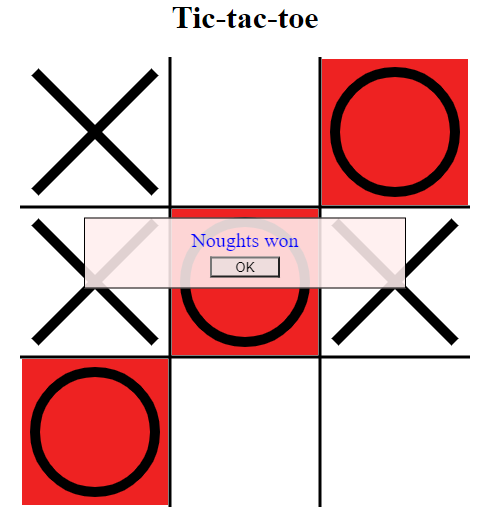

# Tic-tac-toe in HTML5
This repository implements a game of Tic-Tac-Toe on HTML5 canvas. The default mode is human against computer, so unfortunately the best one can do is to make a draw: it is impossible to win in tic-tac-toe if the other side plays optimally.

## Installation
Copy `index.html` and `moves.js` to any folder on your web site or on local disk, and point the browser to index.html. The game works on desktop and on mobile phones.

## Usage
Opening index.html starts the game in default mode. When the game is over, it makes corresponding announcement and offers to play again.

If the URL is appended with `?player=human`, the game will allow the user to play for both sides. If the URL is appended with `?player=random`, the computer will make random moves for noughts instead of optimal moves, so the human player can actually win :)

## Code Structure
This is a demo of how to use &lt;canvas&gt; in a fully funcional game, so I was trying to keep it as simple as possible, but not simpler.

The design constrains were:
* It must be able to play tic-tac-toe
* It should look decent on mobile devices
* It should have little or no external dependencies

`index.html` contains HTML &lt;canvas&gt; object, the Javascript code that draws the game field on it and reacts to the mouse clicks, a few &lt;div&gt;'s and buttons to display game messages, and CSS to handle their appearance and position on screen. I had to throw in a couple media queries to handle mobile devices in portrait and landscape mode.

The Javascript code is entirely contained inside the main HTML file, with the exception of table of computer moves, that is read from `moves.js`. It does not require a bundle manager such as Webpack, and does not use external libraries like JQuery, React, or Angular.

This makes the application somewhat tedious to develop and brings a cap on the application size (how much code can you reasonably squeeze into one file?), but keeps it very easy to deploy and hopefully easy to understand.

`moves.js` file is generated by the C# program `TicTacToeGamePlan`, contained in the same repository.

## Javascript Code
### class Board
Board is a Javascript class (function) that contains the state of the board: the state of each cell, whose move it is, and whether the game is finished. This class does not directly deal with graphics, only with the rules of the game. It defines methods `move()` and `onDrawCell()`, as well as a few auxilliary methods. The cells a numbered from top-lef to bottom-right:

    0 1 2
    3 4 5
    6 7 8
    
`onDrawCell()` allows the caller class to pass a callback, that would be invoked when a particular cell must be redrawn. This is how the Board class handles changes in the visual apperance of the field.

### class RandomPlayer
This class takes a `Board` and defines method `move()`, that implements random playing strategy. It randomly selects an empty cell on the board and puts a nought there by calling `board.move()`. This is not a great strategy for playing tic-tac-toe, the computer usually loses.

### class SmartPlayer
This class has the same interface as `RandomPlayer`, but it uses the reference table from `moves.js` to make the moves, so it's impossible to beat. Current board state is converted to a number between 0 and 19682 (39-1), and that is used as an index in the list of moves to retrieve the optimal move for the position. The list of moves is pre-calculated using a  program named `TicTacToeGamePlan`.

### class Game
This class is the main class of the program. It creates a board and instantiates the auto-player (if any) in the constructor, handles drawing of the cells in the `drawCell` function, and installs mouse click events to handle user moves. When user clicks a cell, it either invokes the auto player (`SmartPlayer` by default), or lets the user play for both sides if no auto player is defined.

 `function Game(autoPlayerClass)` is the constructor. Auto player class can be `SmartPlayer`, `RandomPlayer` or `null` (user plays both sides).

`function drawCell(n, content, isWinner)` draws given cell and highlights it in red if the cell is part of the winning triad. This function gets passed to `board.onDrawCell()` as a callback.

`function onClick(event)` handles mouse clicks. It is passed to the canvas object as a callback.

## The List of Good Moves
`moves.js` defines a function named `getMoves()` that returns a dictionary of position:cell pairs.

    function getMoves() { return {2:4,6:0,17:5,...,19564:0,19570:0,};}

Each number to the left of the colon represents a position in the game where it's nought's turn to move, each number to the right represents the cell a nought should be put in.

Positions are encoded as a ternary number. Empty cell is 0, nought is 1, and cross is 2. So, position

    x O  .
    x O O
    . x x
would be represented as ternary matrix

    2 1 0
    2 1 1
    0 2 2

 leading to ternary number 220112012, or 17879 in decimal. Note that the least significant (last) digit corresponds to the top-left cell, and the most significant (first) digit corresponds to the bottom-right cell. According to the moves table, the optimal move for this position is cell 6, that would prevent cross's victory:

     x O .
     x O O
     O x x

## Generating the Moves
moves.js is generated by C# program `TicTacToeGamePlan` that is located in the same repository. Tic-tac-toe has only 39 or 19683 possible positions (and even fewer that are actually reachable from the initial position), so building the decision tree is not very difficult.

We start with the initial position and make all possible moves. There will be at most 9 moves to consider. For each move, If we have already seen the resulting position, we add it as a child to current position. If we have not seen this position, and it's a final position (someone won or the board is full), it will become the leaf of the tree. If it's not a final position, we repeat the tree building process recursively.

### Score

For each node of the tree we calculate "score" from the perspective of the cross player, using the minimax algorithm. If it's a final position and crosses won, the score is 1. If noughts won, the score is -1. If it's a draw, the score is 0.

The score of inner nodes is defined recursively as maximum score of children if it's cross's turn (cross can choose to make the best move), and minimum score of children if it's the nought's move (noughts can choose the most damaging move).

For each position where it's nought's turn to move, we calculate `RecommendedMove` as the move that leads to a position with the minimum score.

### class Position
`Position` is very similar to Board in Javascript code, but it is immutable. `Move()` method generates a new instance of `Position`. `Position` contains the list of cell states and whose turn it is. Even though it is technically possible to deduce whose turn it is from the position itself, we keep this information handy for the sake of speed.

### class PositionConverter
This class converts a position to a decimal number, using the same algorithm as in Javascript. It is important that the algorithms in C# and Javascript be synchronized, otherwise Javascript code would have difficulty looking up the move by number.

### class PositionScore
This class calculates the score of the (final) position from the perspective of the cross player. It returns 1 if crosses won, -1 if noughts won, and 0 if no one won.

### class PositionTree
This class represents a tree (or, rather DAG) of positions. The tree is immutable, all child nodes must be known at the time of construction. This allows us to calculate the scores and the recommended move in the constructor.

### class PositionTreeBuilder
This class builds the tree (DAG) of positions starting from the initial position (empty field, crosses move). It keeps the list of known positions in the dictionary named `_cache`. It's final outcome is returned by method `GetRecommendedMoves()` that selects the positions where it's nought's turn to move, and returns a map from the position number to the recommended move. This map is ultimately saved in a Javascript file.

### class Program
`Program.Main()` instantiates a PositionTreeBuilder, gets the map of recommended moves and outputs it as a JavaScript dictionary, wrapping it in a function. This output is then used as `moves.js` for the web site.
